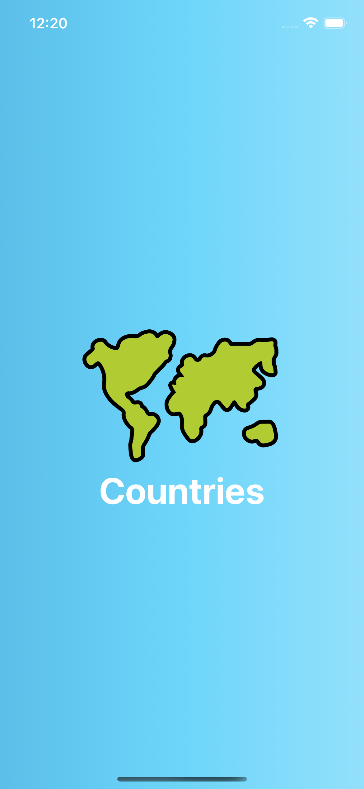
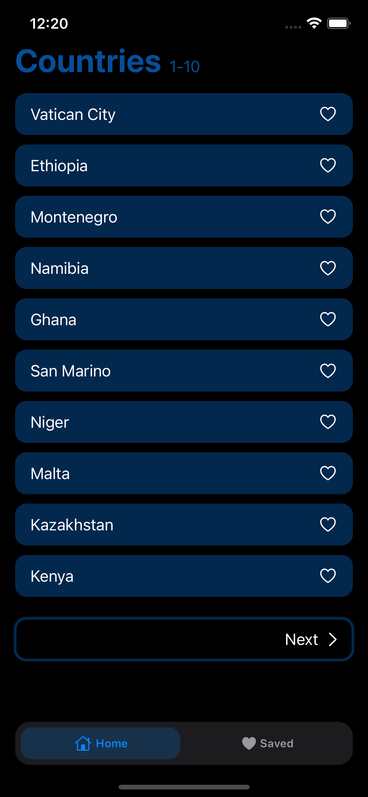
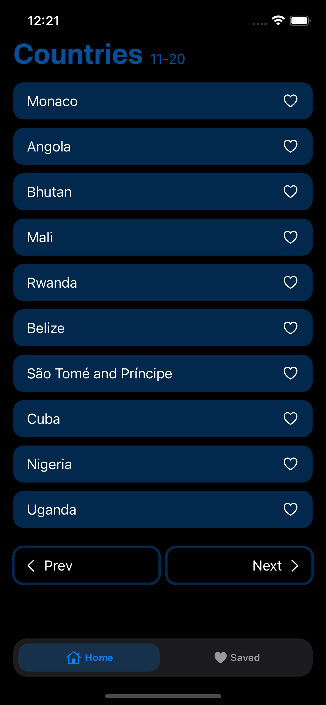
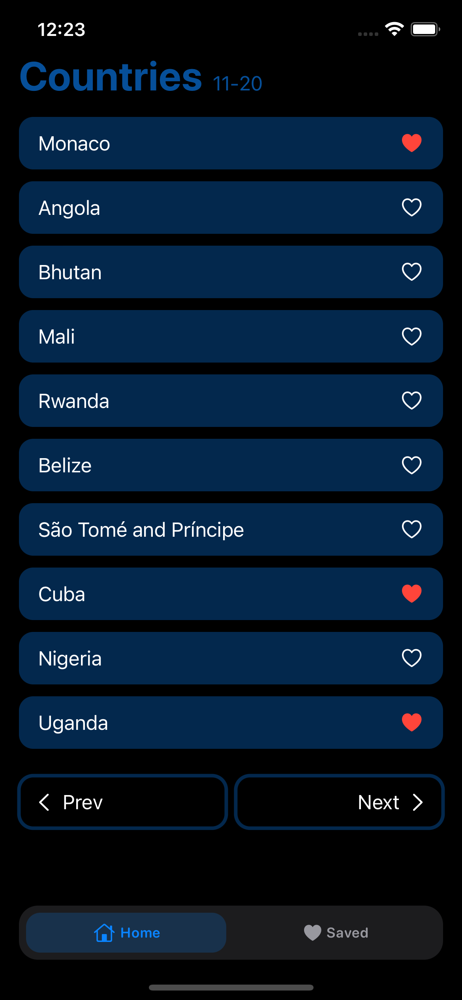
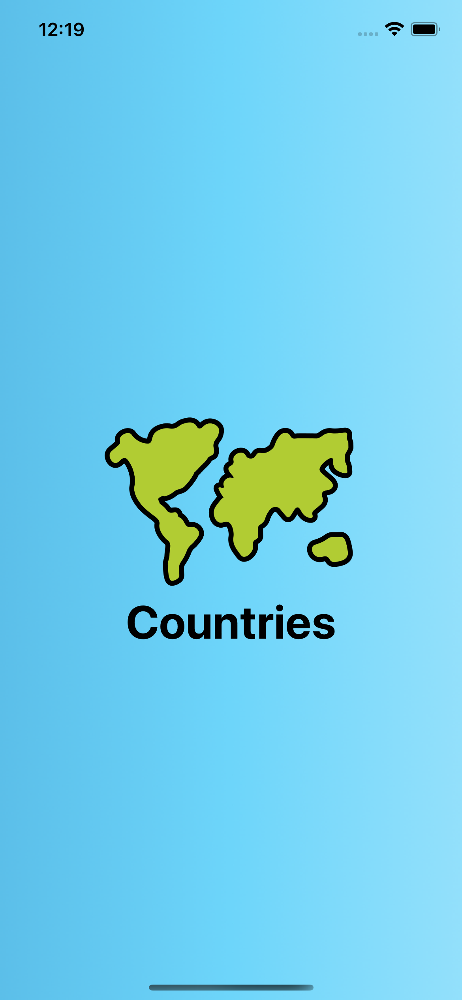
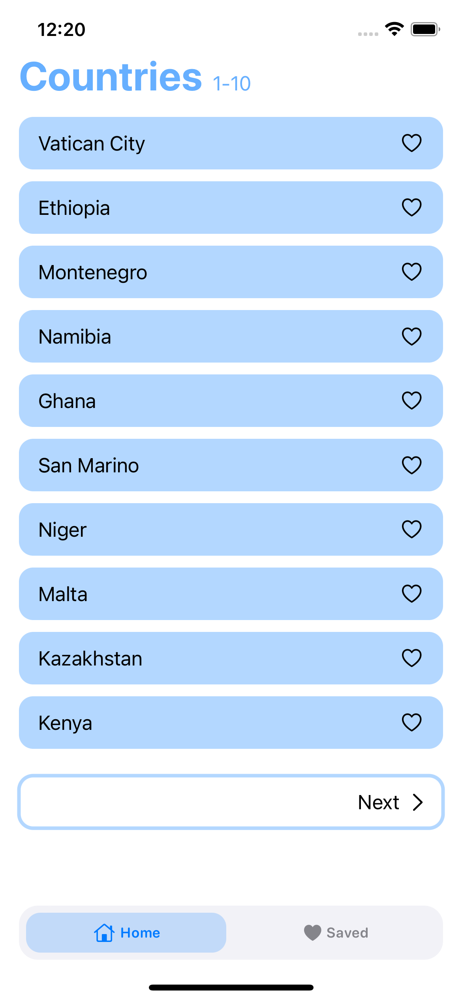
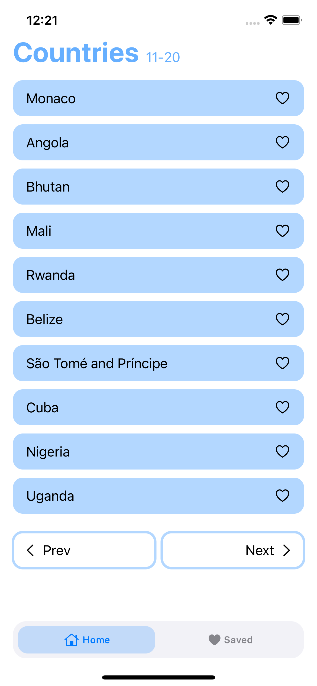
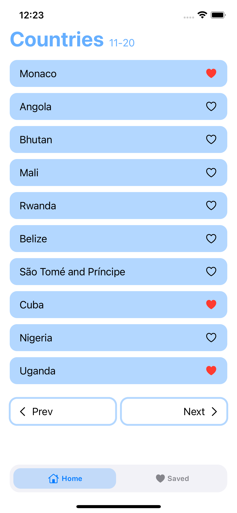

# Countries 🗺
This app was developed by Can Bi. It uses SwiftUI and is written 100% in Swift. The project benefits from multi-threading, publishers/subscribers, and data persistance.

### GeoDB Cities RapidAPI
The app uses [GeoDB Cities RapidAPI](https://rapidapi.com/wirefreethought/api/geodb-cities/)

### Implemented Features
- [x]  Data Structure
- [x]  Networking with Combine and URLSession
- [x]  Downloading and caching images
- [x]  Custom NavigationLink for lazy loading
- [x]  Custom Tab Bar built upon TabView
- [x]  Favorites
- [x]  App icon and Launch Screen

### Dark UI Screenshots
 
### Light UI Screenshots

